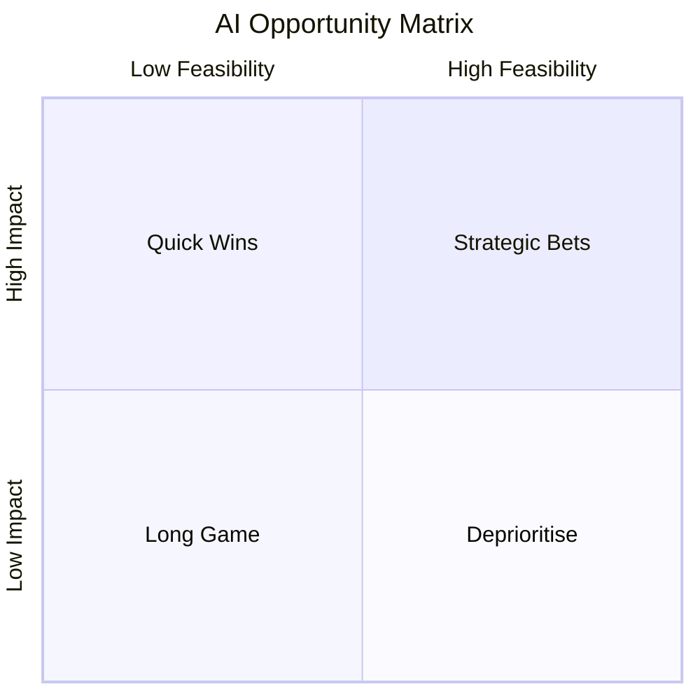

# Strategy

AI strategy fails when it starts with the technology. The right question is never "how do we use AI?" — it's "where does AI change the outcome we're trying to drive?" That reframe alone separates leaders who build durable programmes from those managing an expensive pilot graveyard.

Change management starts here. Before a single use case is prioritised, there needs to be a guiding coalition — a cross-functional group of leaders who are aligned on the direction and credible enough to carry it into their organisations. Without that, strategy becomes a slide deck that lives in a shared drive.

---

## Framework 1: The AI Opportunity Matrix

A simple 2x2 that maps potential AI use cases against two axes: **business impact** (revenue, cost, risk, or customer experience) and **feasibility** (data readiness, technical complexity, change complexity).



The matrix forces an honest conversation. Most organisations want to start with their most ambitious use case. That's usually the wrong move — the change complexity alone will drain momentum before the technology gets a fair trial.

**Change management lens:** The Quick Wins quadrant is not just a strategic choice. It's a change management instrument. Early, visible wins create the proof points that shift sceptics into believers and give sponsors the confidence to defend the programme when it hits friction.

---

## Framework 2: The AI Vision Cascade

Strategy without narrative doesn't land. The Vision Cascade is a communication structure that ensures the AI direction translates cleanly from the C-suite to individual contributors.

```
Level 1 — Executive: "Why does this matter to the business?"
Level 2 — Leadership: "What are we prioritising and why now?"
Level 3 — Management: "What does this mean for my team?"
Level 4 — Individual: "What does this mean for my role?"
```

Each level requires a different message, a different messenger, and a different medium. The same all-hands announcement that works for Level 1 will generate anxiety at Level 4 if it skips the translation.

**Change management lens:** This maps directly to the *Awareness* and *Desire* stages of ADKAR. People cannot want to change if they don't understand why change is happening — or if the message they receive feels irrelevant to their day-to-day.

---

## How to Apply

**Start with a use case audit.** Before building the matrix, collect every AI initiative currently running or proposed across the organisation. Most large companies have more happening than leadership knows. Map them, rationalise them, and kill the ones that don't survive scrutiny.

**Run the matrix as a workshop, not a solo exercise.** The value is in the debate. Bring in functional leaders, a data lead, and at least one frontline voice. The disagreements about where a use case sits are more useful than the output itself — they surface assumptions that need resolving before any work starts.

**Build the coalition before you publish the strategy.** Kotter's principle applies directly here: a guiding coalition must exist before the strategy goes wide. If leaders are hearing the direction at the same time as their teams, the programme starts with a credibility deficit it may never recover from.

**Use the Vision Cascade as a communication plan, not a one-time announcement.** The message needs repeating across multiple channels over months. People need to hear "why" before they can engage with "what" — and they need to hear it from someone they trust, which is usually their direct manager, not an executive.
