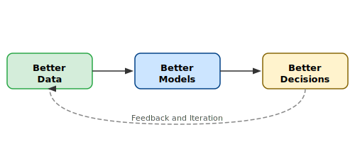

# Data

Most AI programmes hit the data problem about three months in. The use case looked clean in the strategy workshop. Then someone pulls the actual data and finds five years of inconsistent labelling, three source systems that do not talk to each other, and a governance gap that means nobody is sure who owns the fix.

Getting ahead of this requires honest data assessment before committing to a delivery timeline — and a change management approach that treats data quality as a shared organisational responsibility, not a technical task for the data team to solve alone.

---

## Framework 1: The Data Readiness Assessment

Four dimensions that determine whether your data can actually support an AI use case at production quality.

**Availability** — Does the data exist? Is it accessible to the team building the model, or locked behind system permissions and procurement cycles?

**Quality** — Is it complete, consistent, and accurate enough for the use case at hand? "Good enough for reporting" is rarely good enough for AI.

**Lineage** — Can you trace where the data came from, how it has been transformed, and who has touched it? This matters for both model performance and regulatory defensibility.

**Ownership** — Is there a named human accountable for each critical dataset? Ungoverned data drifts.

Score each dimension on a 1 to 4 scale per use case. Any use case with a critical gap at Availability or Ownership should not enter development until those gaps have a resolution plan with an owner and a deadline.

**Change management lens:** Data quality problems are often behaviour problems in disguise. People enter data the way their incentives and their tools encourage them to. Fixing a data quality gap without addressing the upstream process and the people in it produces a clean dataset that degrades the moment the intervention ends.

---

## Framework 2: The AI Data Flywheel

A structural model for how AI programs should compound over time. The flywheel breaks when organisations treat data as a project input rather than a continuous asset.

Each cycle of use generates new signal — user behaviour, model errors, edge cases — that feeds back into improving the data and the model. Organisations that build feedback capture into their AI systems from day one compound faster than those that treat deployment as the finish line.

**Change management lens:** The flywheel only spins if the people using AI outputs are equipped and motivated to provide feedback. That requires Ability and Reinforcement — the final two ADKAR stages. Clear processes for flagging bad outputs, and visible evidence that feedback leads to improvement. If people report issues into a void, they stop reporting.

---

## How to Apply

**Run the Data Readiness Assessment before scoping delivery.** Engineering teams often want to start building before the data picture is clear. Resist this. A three-week assessment that reveals a six-month data gap is far cheaper than a six-month build that uncovers the same gap at go-live.

**Assign data ownership as a named accountability, not a committee.** "The data team owns it" means nobody owns it. Every critical dataset needs a business-side owner — someone with the authority to make decisions about it and the accountability when it degrades.

**Design feedback loops into the product, not as an afterthought.** Thumbs up/down is a floor, not a ceiling. The best AI teams instrument their systems to capture structured feedback signals — confidence scores, override rates, escalation patterns — that generate continuous improvement without relying on users remembering to flag issues.

**Communicate data improvement progress visibly.** One of the most effective change management moves is a simple dashboard that shows data quality metrics trending over time, accessible to the business teams who depend on the data. It makes an invisible problem visible and creates shared accountability for fixing it.
